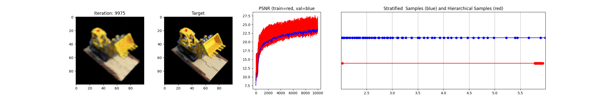

# NeRF Implementation

This repository contains an easy to hack implementation of the NeRF (Neural Radiance Fields) algorithm for synthesizing novel views of a 3D scene.  
Follows paper https://arxiv.org/abs/2003.08934

## Code Structure
main.py : main training process  
model.py : model definitions  
utils.py : some util functions  

## Requirements
python 3.8  
pytorch 2.0.0  
TODO: requirements.txt coming later  

## Usage
python3 main.py

## Credit
The implementation is heavily based on   
https://towardsdatascience.com/its-nerf-from-nothing-build-a-vanilla-nerf-with-pytorch-7846e4c45666  
Highly encourage to take a look

